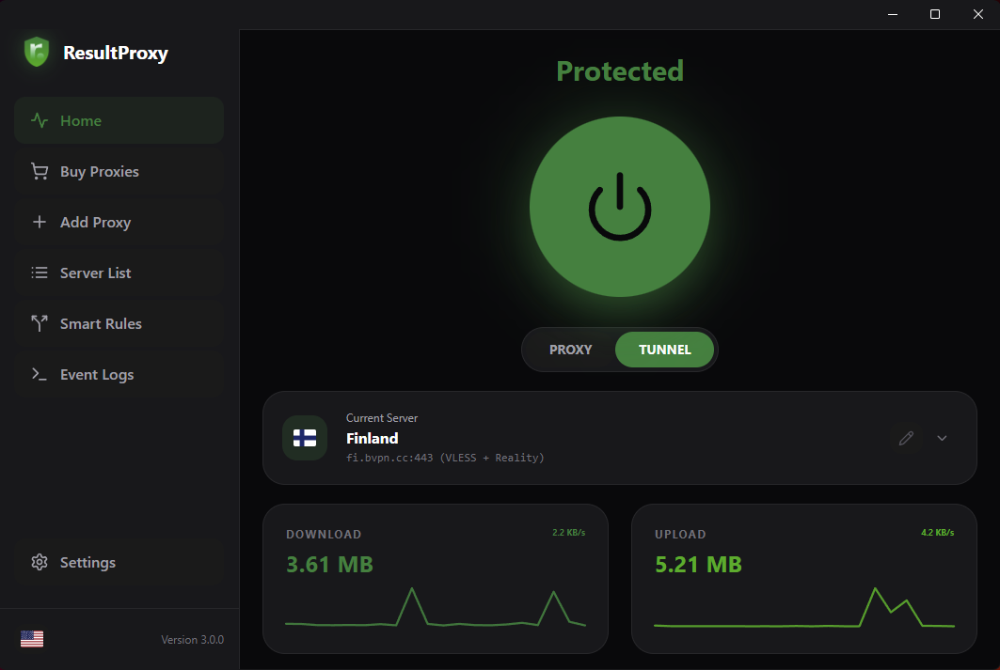
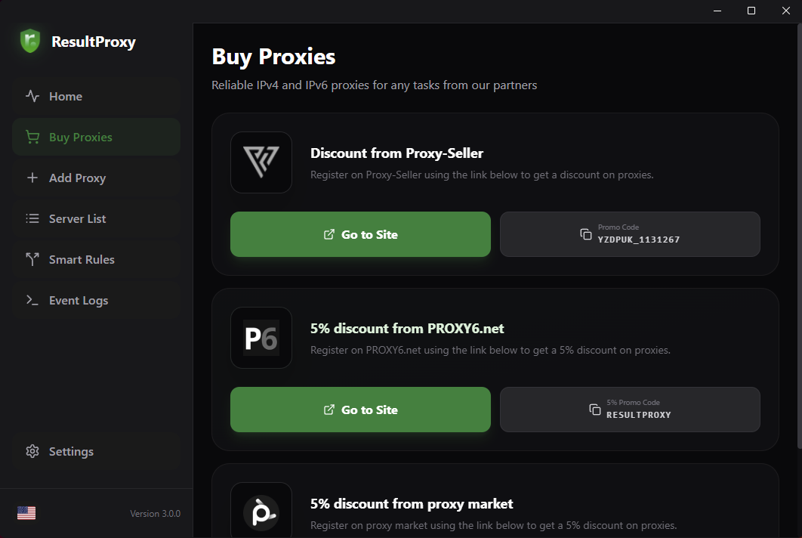
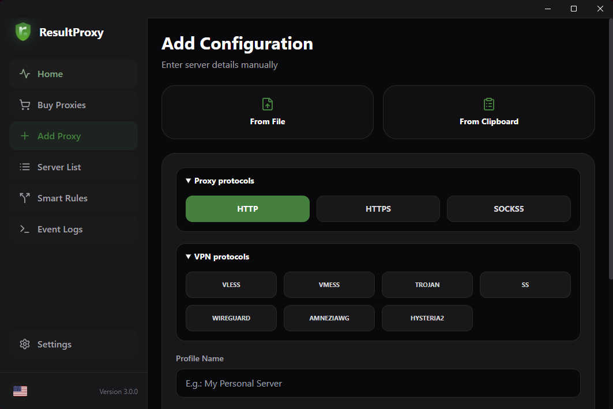
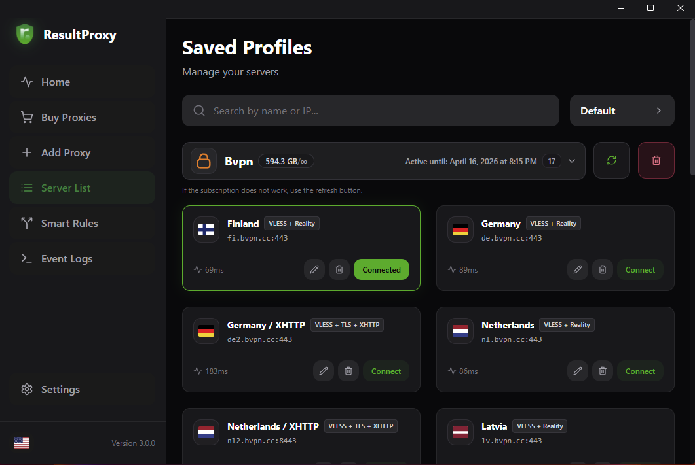
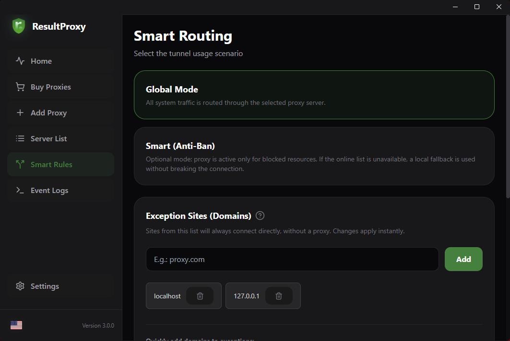
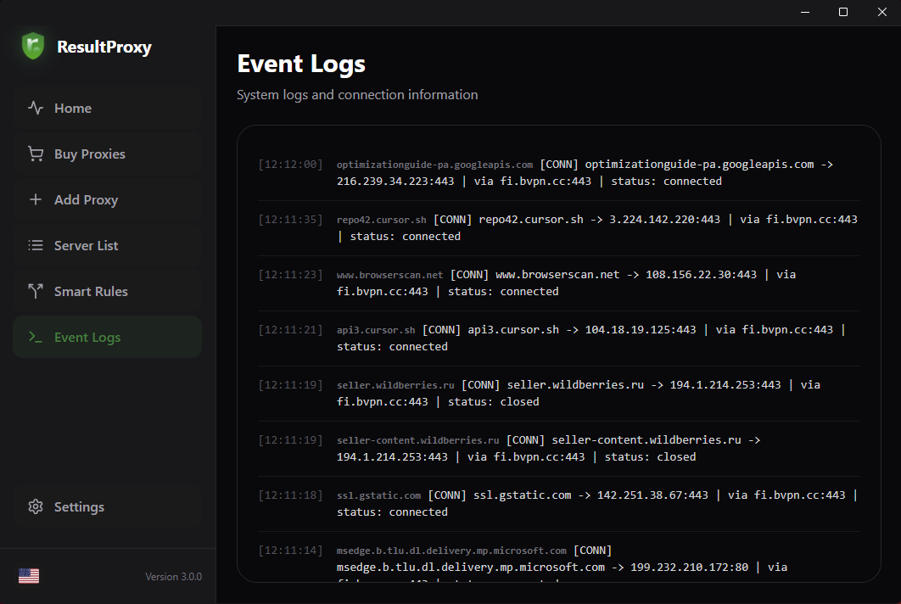
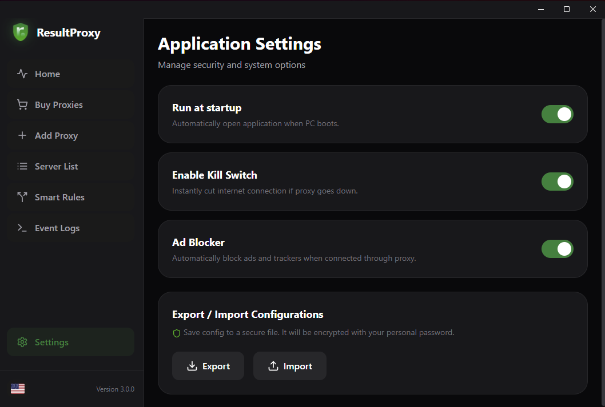

<p align="center">
  
</p>

<h1 align="center">ResultV (prev. ResultProxy)</h1>

<p align="center">
  <b>Desktop proxy client for Windows (macOS/Linux support coming soon) powered by Wails, Go, and sing-box.</b><br>
  Routing, subscriptions, smart rules, and system integration in one app.
</p>

<p align="center">
  
  
  
  
  
</p>

<p align="center">
  <a href="#features">Features</a> •
  <a href="#user-guide">User guide</a> •
  <a href="#development">Development</a> •
  <a href="#building">Building</a> •
  <a href="https://result-proxy.ru/">Website</a>
</p>

<p align="center">
  <a href="./README.md">Русский</a> | <b>English</b>
</p>

---

## Overview

ResultV **3.0.0** is a native desktop application built with **[Wails v2](https://wails.io/)**. The UI is **React 18** with **Vite** and **Tailwind CSS**; traffic is handled by a **Go** backend and **[sing-box](https://github.com/SagerNet/sing-box)** (with project-specific build tags in `wails.json`). The interface is localized with **i18next** (English and Russian).

**Prebuilt releases:** GitHub Actions currently publishes **Windows amd64** artifacts (portable `.exe` and NSIS installer) when a `v*` tag is pushed. **macOS and Linux** code paths exist in the repository, but automated CI releases are currently Windows-only; other platforms will be available later due to the full migration of the project to the Go stack.

---

## Features

- **Proxy mode** and **Tunnel (TUN) mode** for system-wide routing where applicable
- **Protocols:** HTTP, HTTPS, SOCKS5, **VLESS**, **VMESS**, **Trojan**, **Shadowsocks**, **WireGuard**, **AmneziaWG**, **Hysteria2**
- **Subscription URLs:** add, refresh, remove; grouping by provider/country where metadata is available
- **Import:** paste from clipboard or bulk import from `.txt` / `.csv` / `.conf`-style content
- **Smart rules:** Global vs Smart routing; **domain** and **application** exclusions (nested rules supported in the engine)
- **Kill Switch**, optional **ad blocking**, **autostart**
- **Encrypted export/import** of configuration (password-protected payload)
- **Logs** view (frontend and backend messages)
- **System tray** integration
- **Update check** against `update.json` on GitHub (see [Updates](#updates))

---

## Supported protocols and caveats

| Category | Protocols |
|----------|-----------|
| Classic proxy | HTTP, HTTPS, SOCKS5 |
| VPN-style (sing-box) | VLESS, VMESS, Trojan, SS, WireGuard, AmneziaWG, Hysteria2 |

**Important:**

- **WireGuard** and **AmneziaWG** require **Tunnel** mode; they are **not** available in plain Proxy mode (enforced in `internal/proxy/manager.go`).
- **Tunnel** mode on Windows requires **running the app as Administrator** (privilege check before connect).
- **Kill Switch** on Windows may require **administrator** privileges for firewall-style rules (`internal/system/killswitch_windows.go`).
- **VMESS, Trojan, and SS** are **less tested** than VLESS and some other stacks; if you hit failures, contact **@resultpoint_manager** on Telegram.

---

## User guide

Screenshots below use the **English** UI (files in [`docs/images/readme/`](./docs/images/readme/)).

### Home

Connect and disconnect, pick **Proxy** or **Tunnel**, switch active servers, and see traffic summaries when connected.

<p align="center">
  
</p>

### Buy proxy

The **Buy** tab links to partner offers (see [result-proxy.ru](https://result-proxy.ru/)). You can skip this if you already have servers or a subscription.

<p align="center">
  
</p>

### Add server or subscription

Add servers manually or paste **subscription URLs** / share links. Bulk import from clipboard or files is supported.

<p align="center">
  
</p>

### Proxy list

Browse profiles, **ping** servers, edit or delete entries, and work with **subscription-backed** groups.

<p align="center">
  
</p>

### Smart rules

Choose **Global** or **Smart** routing. Configure **domain** exclusions (e.g. `*.example.com`) and **per-application** exclusions so selected apps bypass the tunnel/proxy.

<p align="center">
  
</p>

### Logs

Inspect connection and routing messages to diagnose issues.

<p align="center">
  
</p>

### Settings

**Autostart**, **Kill Switch**, **ad blocking**, and password-protected **export/import**.

<p align="center">
  
</p>

---

## Updates

The app compares its version (from embedded `wails.json` / `GetVersion`) with a remote [`update.json`](https://raw.githubusercontent.com/AandStep/ResultProxy/main/update.json) and can prompt when a newer version is listed. Release metadata and notes are maintained in the root [`update.json`](./update.json).

---

## Development

### Prerequisites

- **Go:** version compatible with [`go.mod`](./go.mod) (see `go` and `toolchain` directives)
- **Node.js:** **20+** recommended (CI uses **24** for releases)
- **Wails CLI v2:** `go install github.com/wailsapp/wails/v2/cmd/wails@latest`
- **Windows:** WebView2 runtime (usually present on current Windows 10/11)

### Run in dev mode

From the repository root:

```bash
wails dev
```

This starts the Vite dev server with hot reload and connects it to the Go backend.

---

## Building

### Local production build

```bash
wails build
```

Add `-nsis` on Windows to produce an installer if NSIS is installed:

```bash
wails build -nsis
```

Outputs land under `build/bin/` (see [`build/README.md`](./build/README.md)).

### CI releases

The [`.github/workflows/release.yml`](./.github/workflows/release.yml) workflow runs `wails build -clean -nsis -platform windows/amd64` and publishes GitHub Release assets.

---

## Tech stack

| Layer | Technology |
|-------|------------|
| Shell | [Wails v2](https://wails.io/) |
| UI | React 18, Vite, Tailwind CSS, i18next |
| Backend | Go |
| Proxy core | sing-box (see `go.mod` and replace directives), project build tags in [`wails.json`](./wails.json) |
| Tray | getlantern/systray (platform-specific code under `internal/getlantern_systray/`) |

---

## License

This project is licensed under the **GNU General Public License v3.0** — see [`LICENSE`](./LICENSE).

---

**Website and downloads:** [https://result-proxy.ru/](https://result-proxy.ru/)
