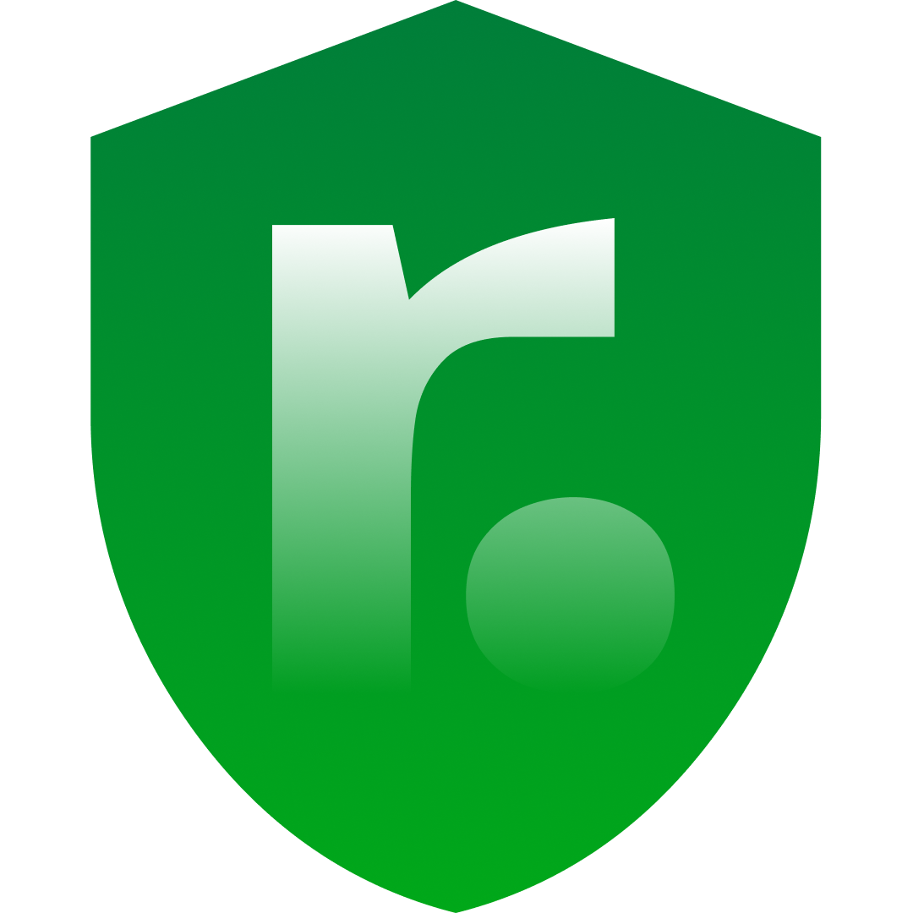

<p align="center">
  
</p>

<h1 align="center">ResultProxy</h1>

<p align="center">
  <b>Кроссплатформенное прокси-приложение со встроенным блокировщиком рекламы.</b><br>
  Больше чем просто прокси — ваш удобный инструмент для обхода блокировок.
</p>

<p align="center">
  
  
  
  
</p>

<p align="center">
  <a href="#-особенности">Особенности</a> • 
  <a href="#-руководство-пользователя">Руководство</a> • 
  <a href="#-установка-и-запуск-для-разработчиков">Установка</a> • 
  <a href="https://result-proxy.ru/">Сайт проекта</a>
</p>

<p align="center">
  <b>Русский</b> | <a href="README.en.md">English</a>
</p>

---

## ✨ Особенности

- Встроенный блокировщик рекламы на базе `@ghostery/adblocker`
- Поддержка HTTP и SOCKS прокси
- Современный пользовательский интерфейс, созданный на React и Tailwind CSS
- Кроссплатформенность (Windows, macOS, Linux)
- Многоязычный интерфейс (интеграция с `i18next`)

## 📖 Руководство пользователя

### После установки приложения
Запустив приложение, вас встретит главная страница.
На главной странице пока нельзя запустить прокси. Чтобы их включить, можно приобрести их [по ссылкам](https://result-proxy.ru/#promo) со скидкой 5% по промокоду **resultpoint**.
Если у вас уже есть прокси, можете пропустить этот этап.

<p align="center">
  
</p>

### Приобретение прокси
На вкладке "Купить прокси" вы можете приобрести прокси у одного из наших партнеров со скидкой 5%.

<p align="center">
  
</p>

### Добавление конфигурации
Нажав на главной странице поле "Добавить сервер" или перейдя во вкладку "Добавить", вы можете ввести данные вашего прокси.
Авторизация для прокси необязательна, но если у прокси есть логин и пароль, их нужно будет ввести.
Также вы можете добавлять один или несколько прокси, вставив их из буфера обмена или .txt/.csv файлов.

<p align="center">
  
</p>

### Список профилей
После добавления прокси вы попадете на страницу "Список прокси". На ней можно подключиться к доступным прокси, удалить или редактировать их, а также увидеть пинг.
Нажав на карточку или кнопку подключения, будет установлено соединение с вашим сервером.
Также прокси можно запускать и останавливать прямо с главной страницы.

<p align="center">
  
</p>

### Запущенный прокси
На главной странице теперь можно увидеть ваше подключение, нажав на карточку раскроется список других прокси.
Здесь же прокси можно редактировать, а также увидеть использование интернета в плашках "Загружено" и "Отправлено".
Чтобы отключить прокси, достаточно нажать на зеленую кнопку выключения.

<p align="center">
  
</p>

### Умные правила
На странице "Умные правила" можно настроить сервисы, которые будут проксироваться.
На выбор дается два режима: Глобальный и Smart (содержит только заблокированные ресурсы, список может не содержать ресурсов, недоступных в вашей стране).
Во вкладке "Сайты-исключения" можно указать конкретные сайты или домены, которые не будут проксироваться. (Пример добавления всего домена: `*.com`).

<p align="center">
  
</p>

Во вкладке "Приложения-исключения" можно выбрать файлы приложений, которые не будут проксироваться, с помощью проводника ОС или введя название программы вручную.

<p align="center">
  
</p>

### Страница логов
На данной странице вы можете просматривать статус вашего прокси и какие сервисы в данный момент проксируются либо попадают в исключения.

<p align="center">
  
</p>

### Настройки приложения
В настройках можно включить автостарт приложения и функцию Kill Switch, которая мгновенно отключит ваше соединение, если прокси упадет.
Также вы можете экспортировать и импортировать конфигурацию вашего приложения, создав пароль шифрования для защиты ваших данных.
В настройках есть и блокировщик рекламы (он не работает для inline блокировки, т.е. баннеры в поиске YouTube могут быть, но рекламы в видео не будет).

<p align="center">
  
</p>

## 🚀 Установка и запуск (для разработчиков)

### Требования

- Node.js (рекомендуется LTS версия)
- npm

### Шаги

1. Клонируйте репозиторий и перейдите в папку проекта:
   ```bash
   git clone <ссылка_на_ваш_репозиторий>
   cd ResultProxy
   ```

2. Установите зависимости:
   ```bash
   npm install --legacy-peer-deps
   ```

3. Запустите проект в режиме разработчика:
   ```bash
   npm run dev
   ```
   *Эта команда одновременно запустит процесс Vite для React и основное окно приложения Electron.*

## 📦 Сборка приложения

Для того чтобы собрать установочные файлы `.exe`, `.AppImage` и другие форматы, используйте следующие команды:

- **Для Windows:**
  ```bash
  npm run package
  ```

- **Для Linux:**
  ```bash
  npm run package:linux
  ```

## 🛠 Технологический стек

- **Кроссплатформенная оболочка:** [Electron](https://www.electronjs.org/)
- **Frontend:** [React](https://reactjs.org/), [Vite](https://vitejs.dev/), [Tailwind CSS](https://tailwindcss.com/)
- **Проксирование и сеть:** `proxy-chain`, `socks`, `express`
- **Блокировка рекламы:** [@ghostery/adblocker](https://github.com/ghostery/adblocker)

---

**Больше информации и загрузка приложения:** [https://result-proxy.ru/](https://result-proxy.ru/)
