# Smart-режим: спецификация

Как устроен «умный» режим ResultV — и для **сайтов** (какой трафик уходит в прокси),
и для **приложений** (какие приложения вообще попадают в туннель).

Документ самодостаточный: по нему можно повторить механику в другом клиенте.
Ссылки на файлы — на текущее состояние ветки `android`.

---

## 1. Что такое Smart-режим

Два режима маршрутизации (`android/.../vpn/RoutingRules.kt`, `enum RoutingMode { Global, Smart }`):

| | Global | Smart |
|---|---|---|
| `route.final` в sing-box | `proxy` | `direct` |
| Что идёт в прокси | всё | только домены из блок-листа |
| Какие приложения в TUN | все, кроме «вне VPN» (denylist) | только «связанные с заблокированным» + браузеры + ручной список (**allowlist**) |
| Роль списка доменов | нет | и роутинг, и подбор приложений |

Идея: у пользователя в РФ 95% трафика — локальный (банк, госуслуги, маркетплейсы,
Яндекс). Гнать его через прокси — это лишняя задержка, лишний трафик и, что важнее,
**сломанные приложения**: банковские и государственные приложения активно
детектируют VPN и отказываются работать. Smart-режим сужает и трафик, и множество
приложений, которые вообще видят `tun0`.

**Двухуровневая фильтрация — ключевой принцип.** Их легко перепутать:

1. **Уровень мембершипа (ОС, Android):** `VpnService.Builder.addAllowedApplication()` —
   какие приложения вообще отдают пакеты в TUN. Приложения вне allowlist работают
   так, будто VPN нет вообще: они не видят наш интерфейс, не видят наш DNS, их
   нельзя сломать. Это **приложенческая** часть Smart-режима.
2. **Уровень роутинга (движок, sing-box):** для тех, кто попал в TUN, правило
   `rule_set: [smart] → outbound: proxy`, всё остальное → `final: direct`. Это
   **сайтовая** часть.

Браузер попадает в TUN всегда (он же ходит на любые сайты), а внутри туннеля уже
работает доменная фильтрация. Приложение YouTube попадает в TUN потому, что
`youtube.com` — в блок-листе, и весь его трафик уходит в прокси по тому же
доменному правилу.

---

## 2. Архитектура

```mermaid
flowchart TB
    subgraph net["Сеть"]
        SRC["Публичные блок-листы<br/>(GitHub raw)"]
        GEO["result-proxy.ru/countryAPI"]
    end

    subgraph go["Go: internal/proxy + mobile (gomobile .aar)"]
        FETCH["HTTPBlockedListProvider<br/>blocked_provider.go"]
        NORM["normalizeDomains +<br/>compressDomainSuffixes"]
        SRS["CompileSmartSRS<br/>smart_ruleset.go"]
        MATCH["MatchSmartPackages<br/>smart_apps.go"]
        CFG["buildRoute<br/>engine.go"]
    end

    subgraph disk["Диск (ctx.filesDir)"]
        JSON["smart-blocked.json<br/>(сырой кэш доменов)"]
        FILE["smart/smart.srs<br/>~509 KB, бинарный rule-set"]
    end

    subgraph kt["Kotlin (Android)"]
        REPO["SmartListRepository<br/>(только метаданные!)"]
        MEMB["SmartAppMembership →<br/>AppTunnelMembership"]
        BOX["BoxModule.openTun →<br/>addAllowedApplication"]
    end

    SEED["APK-asset smart-ru.srs<br/>(seed, cmd/smartsrs)"]

    GEO --> FETCH
    SRC --> FETCH
    FETCH --> NORM --> SRS --> FILE
    NORM --> JSON
    SEED -->|InstallSmartSRSSeed| FILE
    FILE --> MATCH --> MEMB --> BOX
    FILE -->|path в конфиге| CFG
    REPO -.->|FetchSmartList / SmartListStatus| FETCH
```



### Принцип №1: список живёт **только** на диске, в скомпилированном виде

Самое важное архитектурное решение. Список ~86–150k доменов **никогда** не
пересекает JNI и **никогда** не попадает в конфиг sing-box.

Что было (и почему это плохо):
- Kotlin держал все домены в памяти, парсил их `org.json` на главном потоке при
  старте приложения (несколько секунд),
- сериализовал их обратно в `optionsJson` при connect,
- конфиг вырастал до **4.6 MB**, трижды переезжал через JNI и полностью
  ре-парсился sing-box'ом на **каждом** connect ≈ **2 секунды** оверхеда.

Что стало: домены компилируются в бинарный sing-box rule-set (`.srs`) один раз при
обновлении списка. В конфиге остаётся только путь:

```json
"rule_set": [{ "type": "local", "tag": "smart", "format": "binary",
               "path": "/data/.../files/smart/smart.srs" }]
```

Конфиг ~10 KB, загрузка rule-set'а ~17 мс. Smart-connect стоит столько же, сколько
Global. Kotlin хранит только метаданные (`smart-list.meta.json`: страна, счётчик,
источник, время).

### Принцип №2: `local`, никогда `remote`

sing-box умеет `"type": "remote"` для rule_set — и качает его **синхронно на
холодном старте**, а провал загрузки **аварийно завершает запуск движка**. Для
клиента в цензурируемой сети, где туннеля ещё нет, это гарантированный кирпич.
Поэтому оба наших rule-set'а (Smart и ad-block) — только `local`, а скачивание
списков сделано отдельным, полностью не-фатальным фоновым шагом.

---

## 3. Откуда берутся домены (сайты)

`internal/proxy/blocked_provider.go` → `defaultPublicSourceTemplates(country)`.

### Определение страны

`https://result-proxy.ru/countryAPI/api.php` → `{"country":"ru"}` (ISO alpha-2).

Это **свой** эндпоинт. Раньше использовались `geojs.io` / `ipapi.co` /
`ip-api.com` — от них отказались: они отдавали реальный IP пользователя третьим
лицам, а `ip-api.com` работает по plain HTTP. Сейчас в коде жёсткая проверка:
схема обязана быть `https`, иначе запрос не выполняется вовсе
(`resolveCountryFromEndpoint`). Если страну задал пользователь в настройках,
geo-запрос не делается вообще.

Переопределяется через `RESULTPROXY_COUNTRY_API_URL` / `RESULTPROXY_COUNTRY_SOURCES`.

### Списки для RU (7 источников, объединяются)

Реестровые / «режут RU»:
```
https://raw.githubusercontent.com/itdoginfo/allow-domains/main/Russia/inside-raw.lst
https://raw.githubusercontent.com/1andrevich/Re-filter-lists/main/domains_all.lst
https://raw.githubusercontent.com/1andrevich/Re-filter-lists/main/community.lst
```
Точечные сервис-списки (побочные домены сервисов, которых нет в реестровых —
Discord/YouTube CDN, гео-блокирующий RU Google AI Studio):
```
https://raw.githubusercontent.com/itdoginfo/allow-domains/main/Services/discord.lst
https://raw.githubusercontent.com/itdoginfo/allow-domains/main/Services/youtube.lst
https://raw.githubusercontent.com/itdoginfo/allow-domains/main/Services/google_ai.lst
```
Курируемый сообществом веер Discord + хвосты Cloudflare ECH:
```
https://raw.githubusercontent.com/Flowseal/zapret-discord-youtube/main/lists/list-general.txt
```

`Re-filter/domains_all.lst` — самый крупный, ~86k записей / 1.4 MB. Тело каждого
ответа читается через `io.LimitReader(resp.Body, 8*1024*1024)` — 8 MB запас.

### Остальные страны

```
https://raw.githubusercontent.com/citizenlab/test-lists/master/lists/global.csv
https://raw.githubusercontent.com/citizenlab/test-lists/master/lists/{cc}.csv
```

⚠️ **Это не блок-лист.** citizenlab test-lists — это списки для *измерения*
цензуры: сайты, которые стоит проверить, включая заведомо доступные контрольные.
Единственный доступный per-country источник, поэтому используется как fallback,
но с оговорками (см. §7, «Подводный камень №1»).

### Переопределение

`RESULTPROXY_BLOCKED_LIST_SOURCES` (CSV шаблонов, `{country}` подставляется) или
`RESULTPROXY_BLOCKED_LIST_URL_TEMPLATE` (один шаблон).

---

## 4. Конвейер обработки списка

`FetchBlockedDomains` → `parseDomainPayload` → `normalizeDomains` →
`compressDomainSuffixes`.

### 4.1 Парсинг (`parseDomainPayload`)

Форматы определяются автоматически, потому что источники разнородны:
- **CSV** с колонкой `url` (citizenlab) → хост извлекается через `url.Parse`;
- **JSON-массив строк** (начинается с `[`);
- **построчный текст** → `extractDomainFromLine`, который понимает:
  - комментарии `#`, `;`, `!`, `//` (и trailing-`#`),
  - `hosts`-формат (`0.0.0.0 example.com`) — берётся последнее поле, `localhost`/`local` отбрасываются,
  - dnsmasq (`server=/example.com/1.1.1.1`),
  - AdBlock-синтаксис (`||example.com^`).

### 4.2 Нормализация (`normalizeRule`, `router.go`)

lowercase → срезать схему `://` → срезать путь после `/` → срезать `*.` слева и
справа. Дедупликация с сохранением порядка.

### 4.3 Сжатие суффиксов (`compressDomainSuffixes`)

Если в списке есть и `discord.com`, и `cdn.discord.com` — второй выбрасывается,
он уже покрыт родительским суффиксом. На 86k доменов это заметно сокращает и
кэш-файл, и rule-set. Требует уже нормализованного входа.

### 4.4 Резолв с деградацией (`ResolveBlockedDomains`, `blocked_updater.go`)

Порядок и метка `source`:

1. `remote` — успешная загрузка. Сохраняется в `dataDir/smart-blocked.json`.
2. `cache` — с диска. **Если страна в кэше не совпала с резолвнутой — кэш
   отвергается** (переехал в другую страну — не роутим по чужому списку).
3. `local` — файлы с диска, если переданы пути.
4. `builtin` — 7 доменов «на самый край»: `instagram.com`, `facebook.com`,
   `twitter.com`, `x.com`, `t.me`, `discord.com`, `netflix.com`.

Метка `source` — не косметика, на ней завязаны две защиты (см. §7).

---

## 5. Компиляция в SRS и маршрутизация сайтов

### 5.1 `splitSmartDomains` — exact vs suffix

Домены раскладываются в два ведра: чистые IP (`net.ParseIP` ≠ nil) → `domain`
(точное совпадение), всё остальное → `domain_suffix`.

⚠️ Суффикс пишется **без ведущей точки**. Матчер sing-box
(`sing/common/domain`, `rootLabel`) трактует бесточечный суффикс как «сам домен
ИЛИ любой поддомен», с границей по метке: `instagram.com` матчит
`x.instagram.com`, но **не** `fakeinstagram.com`. Суффикс *с* точкой
(`.instagram.com`) матчил бы **только поддомены** — голый SNI `youtube.com` ушёл
бы в `final: direct` и умер бы за блокировкой. Это тихая, крайне неприятная
регрессия — тест на неё обязателен.

### 5.2 `CompileSmartSRS` (`smart_ruleset.go`)

```go
option.PlainRuleSet{ Rules: []option.HeadlessRule{{
    Type: C.RuleTypeDefault,
    DefaultOptions: option.DefaultHeadlessRule{ Domain: exact, DomainSuffix: suffix },
}}}
srs.Write(&buf, ruleSet, C.RuleSetVersion3)
```

Дальше — три обязательных шага:
1. **самопроверка** — записанный буфер сразу читается обратно (`validateSRS`);
2. **атомарная запись** — `os.CreateTemp` + `os.Rename`;
3. **уникальное имя temp-файла**. Фиксированное `path+".tmp"` было багом:
   `CompileSmartSRS` (из `refresh()`, под `fetchLock`) и `InstallSmartSRS`
   (установка seed'а, вне блокировки) живут в разных корутинных скоупах, и их
   `O_TRUNC`-записи перемешивались, публикуя через `rename` склеенный мусор.

Порог `minSmartSRSBytes = 32`: валидный, но пустой rule-set весит ~30 байт, всё
что меньше — заведомо обрубок.

### 5.3 Правила маршрута (`buildRoute`, `engine.go`)

Порядок правил критичен:

```
1. (tunnel) IP прокси-сервера        → direct     # иначе рекурсия в свой туннель
2. (bypassLAN) RFC1918/link-local    → direct     # чисто IP, до sniff
3. sniff                                          # ← без него доменные матчеры слепы
4. protocol: dns                     → hijack-dns
5. (tunnel) port 853                 → reject     # см. подводный камень №6
6. (adblock) ...                     → reject
7. rule_set: [smart]                 → proxy      # ← Smart-роутинг сайтов
8. пользовательские правила (into-VPN домены/приложения)
   final: direct
```

`route.final` вычисляется так:

```go
smartSRS := cfg.SmartMode && localSmartSRSUsable(SmartSRSPath(dataDir))
final := "proxy"
if cfg.SmartMode && (smartSRS || len(cfg.SmartBlockedDomains) > 0) { final = "direct" }
```

То есть **Smart без пригодного списка молча деградирует в Global**, а не в
«туннель-пустышка, который ничего не проксирует». Это осознанный выбор:
безопасный отказ — в сторону работающего обхода блокировок.

`buildSmartRuleSet(dataDir, validated)` принимает уже посчитанный флаг валидности
намеренно: `buildRoute` всё равно его вычисляет для `final`, а повторная проверка
означала бы второе чтение и полный разбор 509 KB SRS (zlib inflate + пересборка
succinct-set) на **каждой** сборке конфига — а она случается при connect, при
переключении browser-ad-block, при kill-switch reload, при любом `triggerReload`.

---

## 6. Smart для приложений (per-app membership)

### 6.1 Правило подбора (`internal/proxy/smart_apps.go`)

Приложение считается «связанным с заблокированным ресурсом», если:

1. Его **обратный DNS-домен** есть в блок-листе: `com.instagram.android` →
   `instagram.com`. Наивно, первые две метки (`labels[1] + "." + labels[0]`), без
   Public Suffix List.
2. Либо для него есть **алиас** в курируемой таблице `DefaultSmartAliases`, и
   алиас в блок-листе:

   | package | домен |
   |---|---|
   | `com.google.android.youtube` (+`.tv`, `apps.youtube.music`) | `youtube.com` |
   | `com.zhiliaoapp.musically` (+`.go`), `com.ss.android.ugc.trill` | `tiktok.com` |
   | `org.thunderdog.challegram` (Telegram X) | `t.me` |

**Точность важнее полноты.** Мембершип *исключает* всё, что не совпало, поэтому
ложноположительное срабатывание активно вредит: банковское/госприложение,
затянутое в туннель по ошибке, сломается — ровно то, ради предотвращения чего
Smart и существует. Пропуски дёшевы: пользователь добавляет приложение вручную в
список «в VPN».

### 6.2 Почему матчинг в Go, а не в Kotlin

Раньше Kotlin держал 150k доменов и пересобирал `HashSet` при каждом connect.
Сейчас: Kotlin шлёт ~200 имён пакетов CSV-строкой (~8 KB) →
`Mobile.MatchSmartApps(packagesCSV, dataDir)` → назад приходит подмножество.

⚠️ **SRS хранит скомпилированное succinct-дерево, а не исходный список.**
`srs.Read` возвращает `DomainMatcher` с пустыми `Domain`/`DomainSuffix` — прочитать
домены обратно нельзя. Поэтому мембершип не «ищет домен в списке», а **опрашивает
матчер**: `matcher.Match("instagram.com")`.

Матчер мемоизируется (`smartMatcherCache`) с инвалидацией по
`path + size + modTime`: чтение SRS стоит ~17 мс, а мембершип считается на
критическом пути connect.

⚠️ Тримминг CSV живёт в `MatchSmartApps` (Go/mobile), а не в
`MatchSmartPackages` — и это не косметика: `DefaultSmartAliases` — точный lookup
по map, так что необрезанное `" com.google.android.youtube "` промахнётся мимо
алиаса и провалится в наивную эвристику, дав `google.com` вместо `youtube.com`.
Тихий ложноотрицательный ответ ровно на тех приложениях, ради которых таблица
алиасов и существует.

### 6.3 Состав allowlist'а (`AppTunnelMembership.smartAllowlist`)

```
allow = matched ∪ browsers ∪ intoVpn − outOfVpn − ownPackage
```

- `matched` — из §6.1;
- `browsers` — «настоящие» браузеры (см. ниже);
- `intoVpn` / `outOfVpn` — ручные списки пользователя (`app_routing.json`);
- `ownPackage` — **всегда** исключён: исходящий дозвон sing-box до прокси не
  должен рекурсивно уходить в собственный туннель.

**Определение браузеров (`AppInventory.browserPackages`)** — тонкое место. Проба:

```kotlin
Intent(ACTION_VIEW, Uri.parse("http://")).addCategory(CATEGORY_BROWSABLE)
queryIntentActivities(intent, MATCH_DEFAULT_ONLY)
```

URI **без хоста** — намеренно. Браузер принимает любой web-URL; deep-link
приложение сужает свой intent-filter до конкретного хоста (`ozon.ru`,
`wildberries.ru`) и на безхостовый URI не отзовётся. Прежний вариант
(`http://example.com` + `MATCH_ALL`) затягивал в «браузеры» Ozon, WB, почту и
банки — и они текли в туннель.

### 6.4 Применение к TUN (`BoxModule.applySmartAllowlist`)

Android API `addAllowedApplication` и `addDisallowedApplication` **взаимно
исключающие** — можно только одно. Отсюда конструкция:

- **Smart** → allowlist (`addAllowedApplication` по каждому пакету);
- **Global** → denylist (свой пакет + «вне VPN»);
- Если Smart-allowlist пуст или ни один пакет не добавился — **fallback на
  denylist**, чтобы туннель не оказался мёртвым.

Поэтому же «в VPN» и «заблокировать» реализованы **не** через API ОС, а через
`package_name`-правила sing-box: только так все три списка сосуществуют.
Заблокированные приложения намеренно **не** исключаются из TUN — они обязаны в
него войти, иначе `reject`-правилу нечего резать.

⚠️ `package_name`-правила требуют, чтобы платформа умела резолвить владельца
соединения (libbox `FindProcessInfo`, Android 10+). Пустые списки не порождают
правил вовсе — именно это убирает резолв владельца с горячего пути, когда фича
не используется.

### 6.5 Кэш инвентаря приложений

`AppInventory` мемоизирует `installedApps` и `browserPackages` на весь процесс:
оба — binder-IPC, и они висели на горячем пути `openTun` при **каждом** connect
(вместе с `getApplicationLabel`, который грузит ресурсы каждого приложения — это
и был 3–5-секундный стопор Smart-connect; метки теперь не резолвятся вовсе).

Кэш инвалидируется `BroadcastReceiver`'ом на `PACKAGE_ADDED`/`REMOVED`/
`FULLY_REMOVED`, зарегистрированным на `applicationContext` и **никогда** не
снимаемым: кэш живёт столько же, сколько процесс, значит и ресивер должен.
Без этого приложение, установленное при поднятом VPN, молча роутилось бы **мимо**
туннеля — незащищённым — до перезапуска процесса (`ResultVpnService` не имеет
`android:process`, делит JVM с `MainActivity` и переживает её надолго).
`init()` вызывается и из `MainActivity.onCreate`, и из
`ResultVpnService.ensureReposReady` — always-on-VPN стартует сервис напрямую и
`MainActivity` не запускает никогда.

---

## 7. Подводные камни

### №1. citizenlab test-lists — это не блок-лист

Для RU они добавляли ~2000 **отечественных, доступных** доменов: `ok.ru`,
`mail.ru`, `vk.com`, `yandex.ru`, `dzen.ru` и даже госмедиа `kremlin.ru`,
`tass.ru`, `ria.ru`. Последствия были двойные: эти сайты гнались через прокси
**и** их приложения затягивались в Smart-allowlist. Для RU они убраны полностью
(коммит `1ba270d`). Для остальных стран остаются как единственный per-country
источник — с этим надо считаться.

### №2. Провал обновления не должен уничтожать хороший список

Разовая недоступность источников роняет резолв в `builtin` (7 доменов). Если бы
это применилось, per-app allowlist схлопнулся бы до нескольких приложений и
трафик бы умер. Защита продублирована на обоих уровнях:

- **Go** — `shouldCompileSmartSRS(source, hasDomains, existingSRSReady)`:
  `builtin` **никогда** не перезаписывает существующий пригодный SRS. Но на
  холодном старте (SRS нет вообще) `builtin` принимается — какая-то блокировка
  лучше никакой.
- **Kotlin** — `shouldReplaceSmartSnapshot(curSource, curEmpty, nextSource)`: та
  же логика для снапшота-метаданных.

Обе функции чистые и покрыты тестами — это не случайно, инвариант слишком важен.

### №3. Битый SRS ломает старт движка

`local` rule_set с невалидным файлом **валит запуск sing-box** — то есть VPN
просто не поднимется. Защита эшелонирована:

- запись атомарна (temp + rename) и самовалидируется до `rename`;
- seed из APK валидируется **до** попадания на диск (`InstallSmartSRS`);
- `localSmartSRSUsable(path)` перед сборкой конфига читает и валидирует файл, а
  при провале **удаляет его** (self-heal) и возвращает `false` — движок стартует
  в Global-роутинге, а следующий refresh запишет чистую копию.

### №4. Первый connect на свежей установке

Без списка Smart деградирует в Global — **все** приложения в туннеле, включая
банки, на те секунды, пока идёт закачка. Решение: seed-SRS зашит в APK
(`android/app/src/main/assets/smart-ru.srs`, 509 KB), генерируется
`cmd/smartsrs`:

```
go run ./cmd/smartsrs -country ru -out android/app/src/main/assets/smart-ru.srs
```

**Регенерировать перед каждым релизом.**

Порядок на старте:
`SmartListRepository.init()` → фоновая корутина `installSeedIfNeeded()` (seed
ставится, только если пригодного SRS нет — свежескачанный список никогда не
затирается более старым seed'ом) → connect ждёт **только** эту установку, через
`awaitSeedInstall()` под `withTimeoutOrNull`.

Ожидание тут обязательно: на пути always-on cold start `ensureReposReady()` и
connect идут почти одним стеком вызовов, и без join сборка конфига обгоняет
запись seed-ассета — первый connect молча уходит в Global.

### №5. Connect не должен ждать сеть — и «ограниченное ожидание» было ложью

Раньше перед connect стоял «bounded warm-up» на загрузку списков. Бонд не
работал: **отмена корутины не прерывает блокирующий JNI-вызов**, который она
оборачивала. Свежая установка честно досиживала 7 последовательных загрузок
(5–13 с).

Сейчас: connect ждёт **только локальный диск** (asset → валидация → JNI-install).
Загрузки идут в фоне, а когда список приезжает — `scheduleListReadyReload()`
делает **однократный** reload движка, чтобы полный список включился без
переподключения руками. Reload не делается, если приехал `builtin`.

### №6. DNS-over-TLS вешает Smart-режим на 25 секунд

Android «Private DNS» сниффится как `tls`, а не как `dns`, значит проскакивает
мимо `hijack-dns`. В Smart с `final: direct` он уходит в direct-outbound и
**стопорится**: устройство долбится в анонсированный внутритуннельный DNS-IP
:853 (там нет DoT-листенера → 5 с i/o timeout), потом в публичные резолверы :853
(~20 с). Лечение — `port: 853 → reject`: DoT падает мгновенно, Android
откатывается на обычный DNS/53, который мы перехватываем. Матчинг по порту не
требует sniff, поэтому правило срабатывает сразу.

### №7. IPv6 в Smart-режиме

Если оператор анонсирует v6-адрес, но чёрнодырит транзит, dual-stack TUN даёт
~5 с стопора на **каждом** direct-соединении по IPv6 — а в Smart через direct
идёт как раз большинство. Поэтому тумблер IPv6 учитывается только вместе с
реальной проверкой достижимости (`NetworkProbe.usableIPv6()`), а стратегия DNS
по умолчанию — `ipv4_only`.

### №8. Правило smart обязано идти после `sniff`

До `sniff` у соединения нет ни Host, ни SNI — доменные матчеры видят пустоту и
всё падает в `final: direct`. То же касается ad-block reject-правил.

### №9. `route.final` в Smart — `direct`, поэтому ошибки «текут наружу»

В Global любой промах правила всё равно уходит в прокси. В Smart промах уходит
**в открытую сеть**. Каждое изменение в списке/матчере надо оценивать по этой
асимметрии: пропущенный домен — это не «чуть медленнее», это «сайт не работает».

### №10. Наивный registrable domain

`SmartRegistrableDomain` не консультируется с Public Suffix List, поэтому
`com.co.uk.app` даст `co.uk`. Риск ложного срабатывания есть, только если сам
такой суффикс окажется в блок-листе — в RU-списке его нет. Осознанно принято:
это подсказка мембершипа, которую пользователь может переопределить.

### №11. TTL и вежливость к источникам

`REFRESH_INTERVAL_MS = 24h`. `ensureLoaded()` уважает TTL, `refresh()` — нет.
Конкурентные вызовы коалесцируются через `fetchLock: Mutex`.

---

## 8. Контракт JNI-биндингов (`mobile/libbox.go`)

gomobile не умеет прокидывать структуры и `[]string` — отсюда JSON-строки и CSV.

| Функция | Вход | Выход |
|---|---|---|
| `FetchSmartList(country, dataDir)` | пустая страна = автодетект | `{"country","source","count","srsReady","error"}` — **без доменов** |
| `SmartListStatus(dataDir)` | — | `{"srsReady","path"}`, без сети |
| `InstallSmartSRSSeed(dataDir, data)` | байты asset'а | `false` без ошибки, если пригодный SRS уже есть |
| `MatchSmartApps(packagesCSV, dataDir)` | CSV пакетов | CSV совпавших; нет списка → пусто (не ошибка) |
| `BuildSingBoxConfigV2(uri, dataDir, optionsJson)` | `optionsJson.smartMode: bool` | конфиг sing-box |

`BuildOptions.SmartBlockedDomainsList` в схеме остался, но с Android **не
заполняется** — это путь для desktop, который всё ещё инлайнит домены.

---

## 9. Как повторить: чек-лист

1. **Источники.** Определить страну (свой HTTPS-эндпоинт, не сторонний geo-API).
   Объединить несколько списков; парсер обязан понимать plain/hosts/dnsmasq/
   AdBlock/CSV/JSON. Ограничить размер тела ответа.
2. **Нормализация.** lowercase, срезать схему/путь/wildcard, дедуп,
   compress-suffix.
3. **Деградация.** remote → cache (с проверкой совпадения страны) → local →
   builtin. Метка источника обязательна.
4. **Компиляция** в бинарный формат движка. Валидация → temp с **уникальным**
   именем → rename. Никогда не отдавать список в конфиг инлайном.
5. **Ссылка из конфига только `local`.** Проверять пригодность файла перед
   сборкой конфига; на провале — удалять и деградировать в Global, а не падать.
6. **Суффиксы без ведущей точки** (или эквивалент в вашем движке) — иначе голый
   домен уйдёт мимо прокси.
7. **Правило smart — после sniff.** DoT/:853 — reject.
8. **Per-app:** reverse-DNS + курируемая таблица алиасов, матчинг там же, где
   живёт список. Точность важнее полноты.
9. **Мембершип TUN:** allowlist = matched ∪ browsers ∪ manual − excluded − self.
   Пустой allowlist → fallback на denylist. Браузеры определять безхостовой
   `http://`-пробой.
10. **Кэш инвентаря приложений** + инвалидация по PACKAGE_ADDED/REMOVED.
11. **Seed в бандле** приложения + однократный post-connect reload, когда
    приедет настоящий список. Connect не ждёт сеть **никогда**.
12. **Тесты** на: bare-suffix семантику, «builtin не затирает хороший список»
    (обе стороны), атомарность записи, восстановление после битого SRS, тримминг
    CSV перед lookup алиасов.

---

## 10. Карта файлов

**Go — ядро**
- `internal/proxy/blocked_provider.go` — источники, загрузка, парсинг, нормализация
- `internal/proxy/blocked_updater.go` — `ResolveBlockedDomains`, деградация
- `internal/proxy/router.go` — `normalizeRule`, `normalizeDomains`, `defaultBlockedDomains`
- `internal/proxy/smart_ruleset.go` — компиляция/валидация/установка SRS, кэш матчера
- `internal/proxy/smart_apps.go` — `SmartRegistrableDomain`, `DefaultSmartAliases`, `MatchSmartPackages`
- `internal/proxy/engine.go` — `splitSmartDomains`, `buildRoute`, `buildDNS`
- `cmd/smartsrs/main.go` — генератор seed-asset'а

**Go — JNI**
- `mobile/libbox.go` — `FetchSmartList`, `SmartListStatus`, `InstallSmartSRSSeed`, `MatchSmartApps`, `shouldCompileSmartSRS`

**Kotlin**
- `vpn/SmartListRepository.kt` — метаданные, TTL, seed, `shouldReplaceSmartSnapshot`
- `vpn/SmartAppMembership.kt` — обёртка над `MatchSmartApps`
- `vpn/AppTunnelMembership.kt` — чистая композиция allowlist'а
- `vpn/AppInventory.kt` — инвентарь приложений и браузеров + инвалидация
- `vpn/AppRouting.kt` / `vpn/AppRules.kt` — ручные списки пользователя
- `vpn/BoxModule.kt` — `openTun`, `applySmartAllowlist`
- `vpn/BuildOptions.kt` — сборка `optionsJson`
- `vpn/ResultVpnService.kt` — порядок connect, фоновое обновление, reload
- `ui/screens/RulesScreen.kt` — UI бейджей «авто/вручную»

**Тесты**
- `internal/proxy/{blocked_provider,blocked_provider_ru,engine_smart,smart_apps}_test.go`
- `mobile/libbox_smartlist_test.go`
- `android/app/src/test/java/com/resultv/android/vpn/{SmartListSnapshotTest,AppTunnelMembershipTest,AppRulesTest}.kt`

> Тесты пакета `internal/proxy` требуют тега сборки: `go test -tags mobile ./internal/proxy/...`
